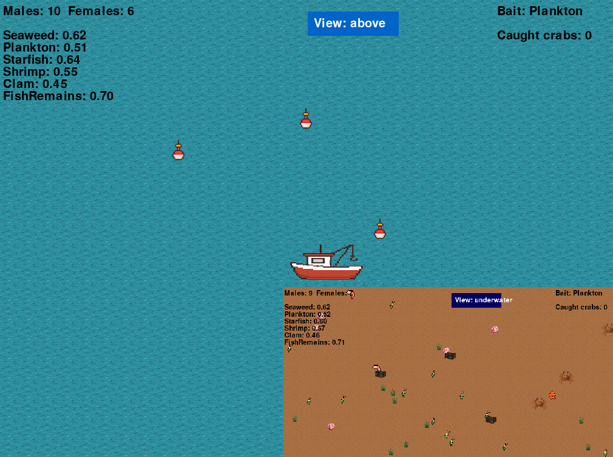

# 🦀 Crabpy

**Crabpy** is a browser-based marine survival game built with Python and [Pygame](https://www.pygame.org/) using [Pygbag](https://github.com/pygame-web/pygbag) for WebAssembly deployment.
Explore the sea, catch crabs — all in a lightweight, pixel-art sandbox!

 

## 🎮 Play Now

👉 [Launch the game in your browser](https://black-beach-0f7cce503.6.azurestaticapps.net)

## 🚀 Features

- 🐚 Dynamic food ecosystem (seaweed, shrimp, starfish, and more)
- 🧠 Adaptive crab AI
- 🎣 Baiting system and reproduction logic
- ⛵ Controllable boat with WASD or arrow keys
- 🌊 Runs directly in the browser — no install needed!

## 🛠 Tech Stack

- **Python 3**
- **Pygame**
- **Pygbag** – compiles Pygame to WebAssembly for the browser
- **Azure Static Web Apps** – free deployment for hobbyists

## 🧩 Controls

- Move Boat: `W A S D` or `↑ ← ↓ →`
- Lower/Raise Crabpots: `[Spacebar]`
- Select bait `1 2 3 4 5 6`
- Let the crabs do their thing...

## 📦 Installation (Local Dev)

```bash
# Clone the repo
git clone https://github.com/yourname/crabpy.git
cd crabpy

# (Optional) Set up a virtual environment
python -m venv .venv
source venv/bin/activate  # or venv\Scripts\activate on Windows

# Install pygame
pip install pygame

# Run game
python main.py

# To run the game browser
pip install pygbag
pygbag . (This will compile to WebAssembly and start a session)
Start a browser an go to http://localhost:8000/
```
Built with 🧠 and ☕ by [AtleFBerg]

📄 License
MIT — free to use, modify, and share. Attribution appreciated!

